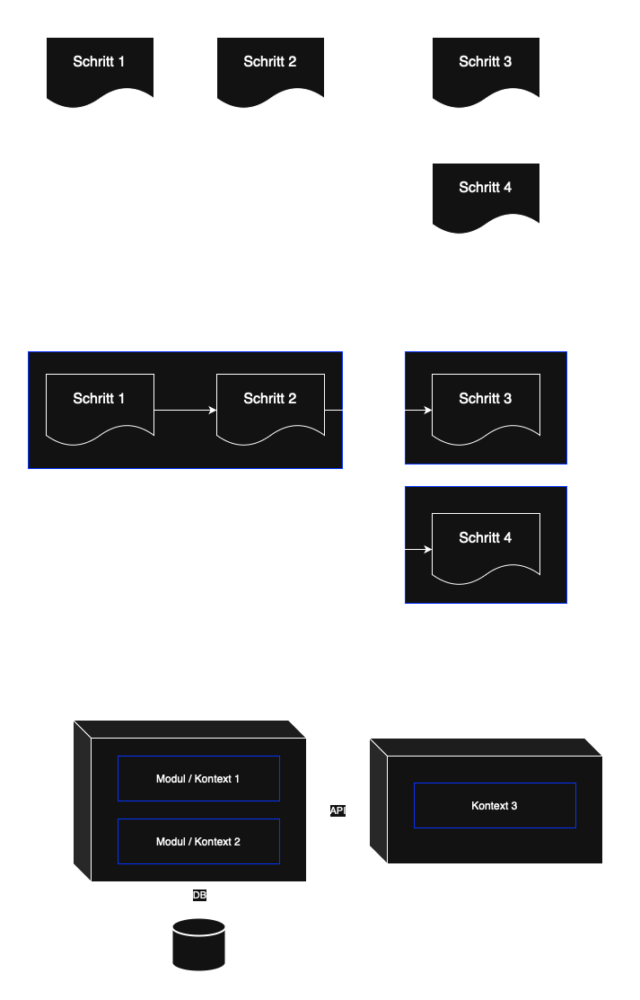

# project-architecture-guide

In dieser Übersicht wird ein Schritt-für-Schritt Leitfaden aufgezeigt.  
Er soll dabei helfen die passende Architektur für ein neues Projekt zu finden.  
Generell haben Kontexte und Kopplung/Kohäsion entscheidenden Einfluss auf die Unterteilung.  
Im fachlichen Abschnitt werden Konzepte von Domain Driven Design (DDD) verwendet.  
Bei den Technologien wird Java & Spring Boot beispielhaft referenziert.  

## 1) Fachliche Anforderungen ermitteln
- Alle relevanten Personen zusammen bringen
  - Meeting-Formate wie Event Storming oder Domain Storytelling 
  - analog mit Post-it's oder digital (zB Miro)
- gemeinsam mit Fachexperten die Domäne verstehen
- eine gemeinsame Sprache (Ubiquitous Language) finden
- Anforderungen sammeln
  - funktional: Fokus auf das "was" (Mehrwert für Kunde)
  - nicht-funktional: Fokus auf das "wie" (Qualitätsmerkmale), zb:
    - Performance (Antwortzeit, Durchsatz, Skalierbarkeit)
    - Zuverlässigkeit (Fehlertoleranz, Verfügbarkeit)
    - Sicherheit (Authentifizierung, Autorisierung)
    - Wartbarkeit (Modularität, Testbarkeit, Dokumentation)
    - Benutzbarkeit (Barrierefreiheit, Fehlermeldungen)
- Geschäftsprozesse bzw Use-Cases grafisch modellieren
  - Akteure/Objekte bilden Knoten im Diagramm
  - Aktivitäten sind Verknüpfungen/Kanten über beschriftete Pfeile

## 2) Kontext-Übersicht erstellen
- Die Domänen in Sub-Domänen unterteilen
- Jede Sub-Domäne kann ein oder mehrere Bounded Contexts haben
- Bounded Context ermitteln und Context-Map (Landkarte) erstellen
  - die Frage klären, welche Bereiche gehören fachlich eng zusammen und welche nicht
  - also wo besteht eine hohe Kohäsion (zusammengehörige Einheiten) 
  - mit gleichzeitig geringe Kopplung zu anderen Bereichen
  - jeder Kontext sollte möglichst isoliert und unabhängig sein, also wenig Abhängigkeiten haben
  - wo gibt es Sprachgrenzen, also unterschiedliche Bedeutungen für denselben Begriff
  - wie sieht die Verantwortlichkeit der Daten im Gesamtprozess aus
- Schnitte einführen, um Kontext-Grenzen deutlich zu machen
- Kontexte kategorisieren
  - Core: Kern der Anwendung, zentrale Business-Prozesse (früher umsetzen, evtl. höher skalieren)
  - Supporting: Unterstützt den Core durch Zusatz-Features (wird erst später umgesetzt)
  - Generic: kein Anwendungsbezug, aber ein notwendiges Übel (kann man dazu kaufen, zb. Nutzerverwaltung)
- siehe auch Strategic Design von DDD

## 3) Services definieren
- aus einem fachlichen Kontext sollen technische Bausteine entstehen
- Aufteilung
  - a) ein Service mit mehreren fachlichen Modulen (modular Monolith = Modulith)
    - über Java Packages oder via Maven-Module
    - bietet zum Projektstart ein einfaches Setup und geringe Kosten
  - b) mehrere separate Microservice, also eigenständig laufende Prozesse
    - initial evtl zu komplex für einfache Context-Map mit kleinem Team
    - kann im späteren Projektverlauf Vorteile bringen
- Einfluss-Faktoren für die Entscheidung:
  - fachliche Komplexität
  - Größe des Entwickler-Teams
  - Entwicklungsgeschwindigkeit (wie oft gibt es Releases/Deployments)
  - Betrieb (Skalierung, Sicherheit, Resilienz, Wartung, Kosten)
  - Datenhaltung
  - Technologie-Vielfalt 

## 4) Kontexte verknüpfen

### 4.1) Beziehungen analysieren
- alle Verknüpfungspunkte zwischen den Kontexten identifizieren
- Abhängigkeiten bzw Richtungen betrachten 
  - Upstream, Downstream: liefernde und verbrauchende Kontexte
  - Conformist: Downstream muss sich anpassen, ohne Einfluss auf Upstream
  - Customer, Supplier: aktive Zusammenarbeit der Kontexte
  - Open Host Service: Kontext bietet Schnittstelle für beliebige Nutzer
  - Shared Kernel: gemeinsame Bibliothek (Lib)
- betrifft sowohl Services als auch Module in einem Service
- Möglichkeiten für die Koordination
  - a) Orchestration (zentraler Punkt, zb Workflow-Engines)
  - b) Choreografie (verteilte Steuerung)

### 4.2) APIs entwerfen
- API Design 
  - a) CRUD: eher technisch formuliert, orientiert an DB (für simplen Service)
  - b) CQRS: Command & Queries, fachlich sprechende Aktionen
  - c) Events: Benachrichtigung trifft ein oder wird versendet
- API Technologie
  - synchron
    - a) REST: für einfache Service-to-Service Kommunikation
    - b) Reactive Stream (Spring Webflux)
    - b) gRPC: falls sehr performante Aufrufe nötig sind
    - c) GraphQL: zwischen Frontend und Backend (selektieren von Properties)
  - asynchron
    - Events: RabbitMQ, Kafka, etc.
- API Daten Modelle
  - das Daten-Schema eines anderen Services soll evtl. nicht übernommen werden
  - bedeutet es muss ein Mapping an der API erfolgen
  - so ist der Service unabhängiger gegenüber Änderungen
  - bzw Änderungen betreffen nicht direkt den Kern der Anwendung
  - in DDD: Anti Corruption Layer
- API Security 
  - zb OAuth2 Flow mit JWT (Spring Security Resource Server)
  - evtl. ein Gateway als zusätzlicher Schutz

## 5) Datenfluss und Speicherart planen

### 5.1) Verteilte Datenhaltung koordinieren
- jeder Service hat seine eigene logische Datenbank
  - evtl. physisch kombiniert, aber kein Zugriff vom anderen Service
  - also keine Kopplung über die Datenbank, damit Zuständigkeit klar ist
- Datenaustausch
  - a) Pull-Modell:
    - Daten eines anderen Kontextes werden bei Bedarf vom Owner-Service abgefragt
    - ist einfacher und braucht weniger Speicherplatz
    - dauert aber länger und ist fehleranfällig
  - b) Push-Modell:
    - Daten eines anderen Kontextes werden im eigenen Service zusätzlich gespeichert/dupliziert
    - hier reicht unter Umständen eine Teilmenge, also nur so viel wie nötig
    - Aktualisierung der Daten per Event vom Owner-Service notwendig
    - ist komplizierter und braucht mehr Speicher
    - dafür viel schneller und man ist unabhängiger während der Verarbeitung
    - ist bei DDD üblich, denn Entitäten können in mehreren Bounded Contexts vorhanden sein

### 5.2) Interaktion mit der Datenbank
- den aktuellen Zustand speichern oder Event Sourcing
- lokale Transaktionen (@Transactional) für zusammenhängende Geschäftsprozesse
- Saga Pattern: service-übergreifende Prozesse (ggf. Kompensationsoperation)
- Transaction Outbox Pattern: garantierte Event-Zustellung über extra DB-Tabelle

### 5.2) Datenbank designen
- Datenbank Technologie  
  - a) SQL: strukturierte Daten, komplexe Abfragen
    - Postgres, MySql, etc
    - Spring Data JPA (komplex) oder Data JDBC (einfach)
  - b) NoSQL: unstrukturierte Daten, einfache Abfragen, gute Skalierung
    - MongoDb, etc
    - Spring Data MongoDB
- Datenbank Tabellen Design
  - siehe auch DDD Tactical Design (Entity, Value Object, Aggregate)
  - große verschachtelte Graphen vermeiden, Konsistenzgrenzen einführen
  - wenn nötig mit IDs arbeiten statt direkt zu referenzieren

## 6) Services intern unterteilen
- ein Service (bzw jedes Modul davon) wird in Schichten/Ringe aufgeteilt
- jede Ebene sollte lose gekoppelt sein zur anderen (Interfaces, Spring Modulith)
  - a) 3-Layer (API, Business, DB): von oben nach unten gerichtet
  - b) Ports/Adapter, Hexagonal, Onion: von außen nach innen gerichtet
- die Geschäftslogik sollte möglichst frei von Technologien sein (wenig Spring)
- Aufteilung von Logik und Daten
  - a) Transaction Script:
    - Trennung von Logik und Daten/State (nicht klassisch objektorientiert)
    - DB Entitäten haben nur Daten/State (Anemic Domain Model)
    - alle Geschäftslogik liegt in Service-Klassen
    - geeignet für einfache Prozesse
    - kann irgendwann komplex werden (Service A -> Service B -> Service C)
  - b) Domain Model / Object Oriented Design
    - Logik und Daten/State gemeinsam in einer Klasse (Rich Domain Model)
    - keine Setter nutzen, sondern stattdessen fachliche Methoden
    - Services sind sehr klein und delegieren nur weiter an die Domain Objekte
    - besser erweiterbar/verständlich in einer komplexen Umgebung

## Architektur entwickelt sich weiter
- die Architektur muss stetig verfeinert und angepasst werden
- ein perfekter Entwurf zum Projektstart ist unrealistisch
- Gravierende Änderungen/Entscheidungen sollten als ADR festgehalten werden

## Dokumentation der Architektur
- die Doku sollte eher schlank gehalten sein 
- so können Änderungen einfach erkannt und integriert werden
- der Fokus sollte auf konstante/stabile Bereiche gelegt werden
- Elemente die sich noch häufig ändern nur auf hoher Flugebene anreißen
- Arc42: https://arc42.de/overview/
- Canvas: https://canvas.arc42.org
- https://github.com/feststelltaste/software-component-canvas

## Ablauf

