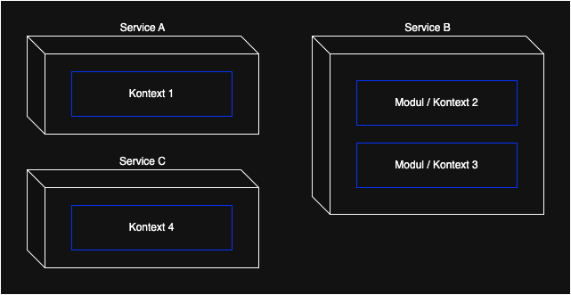
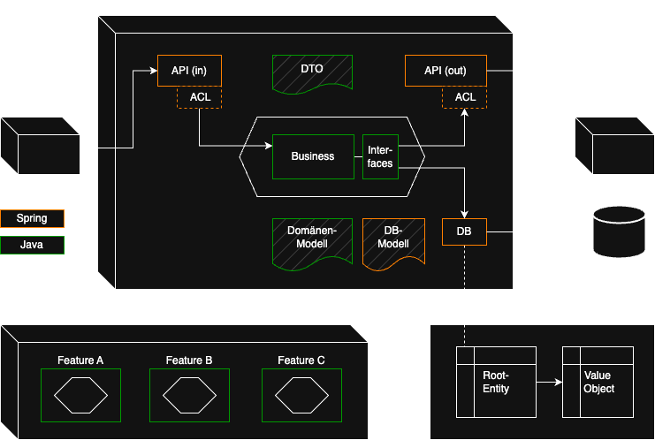
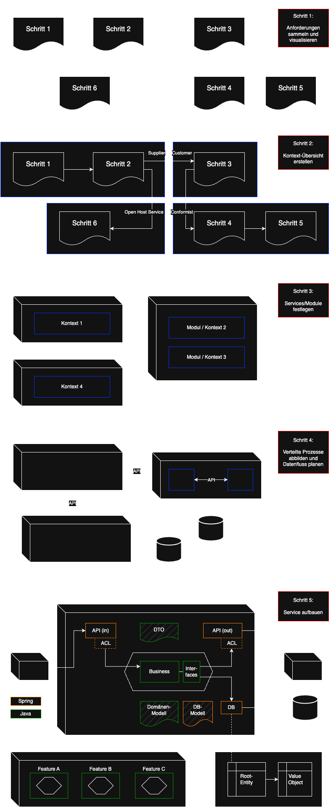

# software-architecture-guide

## Intro

- Allgemein
  - In diesem Dokument wird ein Architektur-Leitfaden aufgezeigt
  - Schritt-für-Schritt werden aufbauend einzelne Abschnitte beschrieben
  - beginnend bei der Fachlichkeit, gefolgt von der technischen Umsetzung
  - es soll dabei helfen den passenden Aufbau für ein Projekt zu finden
  - generell spielen unabhängige Kontexte und Kopplung/Kohäsion eine große Rolle
  - es sind viele Konzepte von Domain Driven Design (DDD) enthalten
  - denn die fachlichen Abläufe sollten in der Technik abgebildet werden
  - bei den Technologien wird Java & Spring Boot beispielhaft referenziert
- Abschnitte
  - [1) Fachliche Anforderungen sammeln und visualisieren](#1-Fachliche-Anforderungen-sammeln-und-visualisieren)
  - [2) Fachliche Kontext-Übersicht erstellen](#2-Fachliche-Kontext-Übersicht-erstellen)
  - [3) Technische Services und Module festlegen](#3-Technische-Services-und-Module-festlegen)
  - [4) Services/Module verknüpfen und Datenfluss planen](#4-ServicesModule-verknüpfen-und-Datenfluss-planen)
  - [5) Service bzw Modul intern unterteilen](#5-Service-bzw-Modul-intern-unterteilen)
- Außerdem werden [Tipps für den Projektverlauf](#Projektverlauf-überwachen) gegeben

## 1) Fachliche Anforderungen sammeln und visualisieren

- Alle relevanten Personen zusammen bringen
  - Fachexperten, Techniker, Projektleitung, etc
  - Meeting-Formate wie Event Storming oder Domain Storytelling
  - siehe auch [Link](https://www.youtube.com/watch?v=H1hzIFACDHE) bzw [Link](https://www.youtube.com/watch?v=EaKWQ1rsaqQ) 
  - analog mit Post-it's oder digital (zB Miro)
- gemeinsam mit Fachexperten die Domäne verstehen
- eine gemeinsame Sprache (Ubiquitous Language) finden
- Anforderungen sammeln
  - funktional: Fokus auf das "was" (Mehrwert für Kunde)
  - nicht-funktional: Fokus auf das "wie" (Qualitätsmerkmale), zb:
    - Performance (Antwortzeit, Durchsatz, Skalierbarkeit)
    - Zuverlässigkeit (Fehlertoleranz, Verfügbarkeit)
    - Sicherheit (Authentifizierung, Autorisierung)
    - Wartbarkeit (Modularität, Testbarkeit, Dokumentation)
    - Benutzbarkeit (Barrierefreiheit, Fehlermeldungen)
    - siehe auch [Link](https://quality.arc42.org)
  - Praxis-Beispiel: siehe [Link](https://youtu.be/nJtEvdxvfNQ?t=702)
- Geschäftsprozesse bzw Use-Cases grafisch modellieren
  - Akteure/Objekte bilden Knoten im Diagramm (später Service oder Entity im Code)
  - Aktivitäten sind Verknüpfungen/Kanten über beschriftete Pfeile (später API oder Methode)

## 2) Fachliche Kontext-Übersicht erstellen

## 2.1) Kontexte ermitteln
- Die Domäne in Sub-Domänen und Bounded Contexts unterteilen
  - Sub-Domäne
    - Teil vom Problem-Raum
    - fachlicher Teilbereich der Gesamt-Domäne
    - ergibt sich ganz natürlich in den Gesprächen mit Fachexperten
    - kann ein oder mehrere Bounded Contexts haben
    - zb "Bestellung", "Zahlung" oder "Produktkatalog" in E-Commerce
  - Bounded Context
    - Teil vom Lösungsraum
    - der Kontext entsteht aus der fachlichen Sub-Domäne (Übergang Fachlichkeit zu Technik)
    - wird explizit modelliert während des Projekts anhand von Randbedingungen
    - Begrenzung der Gültigkeit eines bestimmten Modells und der zugehörigen Sprache
    - zb "Order-Context", "Payment-Context" oder Product-Context in E-Commerce
    - ein Kontext kann später zu einem technischen Service werden, muss aber nicht
    - ebenso sind mehrere Kontexte als Module in einem Service möglich
  - siehe auch [Link](https://www.youtube.com/watch?v=yQgCmMBNle4)
- Context-Map (Landkarte) erstellen, siehe auch [Link](https://www.youtube.com/watch?v=c5H0APovhsw)
- Schnitte einführen, um Kontexte deutlich voneinander abzugrenzen, je nach:
  - Zusammengehörigkeit
    - die Frage klären, welche Bereiche gehören fachlich eng zusammen und welche nicht
    - also wo besteht eine hohe Kohäsion mit gleichzeitig geringe Kopplung zu anderen Bereichen
    - jeder Kontext sollte möglichst isoliert und unabhängig bestehen können
  - Modell- und Sprachgrenzen
    - wo gibt es sprachliche Differenzen, also unterschiedliche Bedeutungen für denselben Begriff
    - ein Domänen-Objekt soll nicht global einheitlich für alle Bereiche gelten
    - stattdessen hat jeder Kontext sein eigenes individuelles Modell
    - Beispiel "Bestellung": Unterschied zwischen Vertrieb und Logistik, aber gleicher Name
  - Verantwortung über Daten
    - wie sieht die Verantwortlichkeit der Daten im Gesamtprozess aus
    - welcher Kontext besitzt welche Daten, wo gibt es Abhängigkeiten
    - wichtig für die spätere Verknüpfung der Kontexte
- Kontexte in Kategorien einteilen
  - Core: Kern der Anwendung, zentrale Business-Prozesse (früher umsetzen, evtl. höher skalieren)
  - Supporting: Unterstützt den Core durch Zusatz-Features (wird erst später umgesetzt)
  - Generic: kein Anwendungsbezug, aber ein notwendiges Übel (kann man dazu kaufen, zb. Nutzerverwaltung)
- siehe auch Strategic Design von DDD, bzw [Link](https://www.youtube.com/watch?v=NvBsEnDgA4o) und [Link](https://www.youtube.com/watch?v=ttIRNyoLKqE)

## 2.2) Kontext-Beziehungen definieren
- alle Beziehungen zwischen Kontexten identifizieren
- Abhängigkeiten bzw Richtungen betrachten
  - Upstream, Downstream: liefernde und verbrauchende Kontexte
  - Conformist: Downstream muss sich anpassen, ohne Einfluss auf Upstream
  - Customer/Supplier: aktive Zusammenarbeit der Kontexte
  - Partnership: beide Seiten sind gleichberechtigt
  - Open Host Service: Kontext bietet Schnittstelle für beliebige Nutzer
  - Shared Kernel: gemeinsame Bibliothek (Lib)
  - Separate Ways: Kontexte haben nichts miteinander zu tun und bleiben unabhängig
- in DDD: Context Mapping
- die Einordnung in eine Kategorie hat Einfluss auf die späteren APIs
- also wie stark die Kopplung ist und wo Modellgrenzen liegen
- Entkopplung der Modelle über Anti Corruption Layer (ACL) möglich
  - das Modell eines anderen Kontextes soll evtl. nicht übernommen werden
  - bedeutet es muss ein Mapping an der API erfolgen
  - so ist der Kern eines Kontextes unabhängig gegenüber Änderungen am anderen Modell

## 3) Technische Services und Module festlegen

- aus den fachlichen Kontexten sollen technische Bausteine entstehen
- jeder Kontext kann ein eigenständiger Service sein, oder nur ein Modul im Service
- Aufteilung
  - a) ein Service mit mehreren fachlichen Modulen (modular Monolith = Modulith)
    - über Java Packages oder via Maven-Module
    - bietet zum Projektstart ein einfaches Setup und geringe Kosten
  - b) mehrere separate Microservice
    - eigenständig laufende Prozesse, optional auch eigene Git-Repo's
    - initial evtl zu komplex, aber kann im späteren Projektverlauf Vorteile bringen
  - siehe auch [Link](https://www.youtube.com/watch?v=6-Wu178sOEE)

| Einflussfaktoren für die Entscheidung                     | Modulith  | Microservices |
|-----------------------------------------------------------|-----------|---------------|
| fachliche Komplexität, also funktionale Anforderungen     | klein     | groß          |
| Qualitätsmerkmale (zb Skalierung, Resilienz, Kosten)      | limitiert | flexibler     |
| Größe des Entwickler-Teams                                | klein     | groß          |
| Unterschiedliche Release-Zyklen der Kontexte              | nein      | ja            |
| Deployment-Automatisierung (Pipelines) notwendig          | nein      | ja            |
| Unabhängige Datenmodelle der Kontexte (einfach umsetzbar) | nein      | ja            |
| Technologie-Vielfalt                                      | nein      | ja            |

## 4) Services/Module über APIs verknüpfen und Datenfluss planen

### 4.1) Verteilte Prozesse koordinieren
- die Geschäftsprozesse sollen in der Technik abgebildet werden
- falls dies über mehrere Services hinweg geschieht, ist eine Koordination notwendig
- die Auswahl der Koordinationsart hat Einfluss auf das spätere API-Design
- Saga Pattern: 
  - übergreifende, verteilte Transaktion 
  - mit letztendlicher Konsistenz (eventual consistency), kein ACID
  - ist in eine Reihe kleinerer, lokaler Transaktionen aufgeteilt
  - ggf. sind Kompensationsoperationen notwendig
- umgesetzt durch:
  - a) Orchestration 
    - ein zentraler Punkt steuert aktiv die einzelnen Services
    - klare Kontrolle über den Prozessfluss, aber zentrale Abhängigkeit/Kopplung
    - Kompensation: Orchestrator kennt die Reihenfolge und führt Gegenaktionen aus
    - APIs müssen explizite Kommandos bereitstellen (zb /cancel-order)
    - zb Workflow-Engines wie Camunda
  - b) Choreografie 
    - verteilte Steuerung in den Services
      - a) über Events und einen Message-Broker
      - b) direkte Http-Aufrufe (keine Entkopplung, eher verteilte Orchestrierung)
    - hohe Entkopplung und Flexibilität möglich, aber Fluss ist weniger transparent
    - Kompensation: hören auf Events von anderen Services (zb OrderCreationFailed)
  - siehe auch [Link](https://www.informatik-aktuell.de/entwicklung/methoden/orchestrieren-oder-choreografieren-ueber-eine-streitfrage-in-microservices-architekturen.html)

| Einflussfaktoren für die Entscheidung               | Orchestration | Choreografie |
|-----------------------------------------------------|---------------|--------------|
| komplexe Geschäftsprozesse liegen vor               | ja            | nein         |
| viele Fehlerszenarien vorhanden, Monitoring wichtig | ja            | nein         |
| strenge Konsistenzregeln notwendig                  | ja            | nein         |
| Services werden von mehreren Teams verwaltet        | nein          | ja           |
| leichtes Hinzufügen von neuen Services              | nein          | ja           |
| skalieren, parallele Abläufen entscheidend          | nein          | ja           |

### 4.2) Verteilte Datenhaltung steuern
- jeder Service hat seine eigene logische Datenbank
  - evtl. physisch kombiniert, aber kein Zugriff vom anderen Service
  - also keine Kopplung über die Datenbank, damit Zuständigkeit klar ist
- Datenabruf via:
  - a) Pull-Modell:
    - Daten eines anderen Kontextes werden bei Bedarf vom Owner-Service abgefragt
    - ist einfacher und braucht weniger Speicherplatz
    - dauert aber länger und ist fehleranfällig
  - b) Push-Modell:
    - Daten eines anderen Kontextes werden im eigenen Service zusätzlich gespeichert/dupliziert
    - hier reicht unter Umständen eine Teilmenge, also nur so viel wie nötig
    - Aktualisierung der Daten per Event vom Owner-Service notwendig
    - ist komplizierter und braucht mehr Speicher
    - dafür viel schneller und man ist unabhängiger während der Verarbeitung
    - ist bei DDD üblich, denn Entitäten können in mehreren Bounded Contexts vorhanden sein
  - c) Kombination/Hybrid-Ansatz, je nach Art der Daten, bzw je nach Last im System
  - siehe auch [Link](https://www.youtube.com/watch?v=tvs-h8aCjCg)

### 4.3) Interaktion mit der Datenbank
- wie wird gespeichert
  - a) den aktuellen Zustand speichern (CRUD), keine Historie
  - b) oder Event Sourcing
    - Events speichern (nur hinten anfügen, nichts löschen)
    - Zustand per Replay ermitteln (alle Events „aufsummieren“)
    - bzw Zwischenstände (Snapshots) festhalten für bessere Performance
    - siehe auch [Link](https://www.youtube.com/watch?v=yFjzGRb8NOk) bzw [Link](https://www.youtube.com/watch?v=ss9wnixCGRY)
- bei Bedarf CQRS
  - schreibende und lesende Aktionen trennen, also zwei separate Datenbanken
  - Query-Seite ist optimiert für schnelles Lesen, evtl. denormalisiertes Modell
  - Synchronisation/Aktualisierung notwendig per Event
- Transaktionen
  - Ausführung zusammenhängender Geschäftsprozesse (alles oder nichts)
  - das System bleibt in einem gültigen Zustand
  - a) lokale Transaktionen innerhalb einer Klasse (zb @Transactional) 
  - b) Saga Pattern: service-übergreifende Transaktion (ggf. Kompensationsoperation)
  - c) Transaction Outbox Pattern: garantierte Event-Zustellung über extra DB-Tabelle, siehe auch [Link](https://www.youtube.com/watch?v=tQw99alEVHo)

### 4.4) Datenbank designen
- Datenbank Technologie  
  - a) SQL: strukturierte Daten, komplexe Abfragen
    - Postgres, MySql, etc
    - Spring Data JPA / Hibernate: komplex, mit Cache/Persistence-Context und Dirty Checking 
    - oder Data JDBC: einfacher, ohne Caching, führt SQL sofort aus, orientiert an DDD Aggregates
    - siehe auch [Link](https://www.youtube.com/watch?v=AnIouYdwxo0)
  - b) NoSQL: unstrukturierte Daten, einfache Abfragen, gute Skalierung
    - zb MongoDb via Spring Data MongoDB
    - speichern von Objekten ohne extra Entity-Klasse & Repository möglich
- Datenbank Tabellen Design
  - Tabellen normalisieren, um Redundanzen zu minimieren
  - große verschachtelte Graphen vermeiden, Konsistenzgrenzen einführen
  - wenn nötig mit IDs arbeiten statt direkt zu referenzieren
  - siehe auch DDD Tactical Design (Entity, Value Object, Aggregate)
  - und [Link](https://www.youtube.com/watch?v=xFl-QQZJFTA) bzw [Link](https://www.youtube.com/watch?v=BFXuFb40P8k)

### 4.5) APIs entwerfen
- API Konzept/Design
  - generell sollten Schnittstellen fachlich modelliert werden, siehe auch [Link](https://www.youtube.com/watch?v=K2eiHDtoo-A)
  - a) CQRS:
    - Commands:
      - Aufträge, imperativ, POST, Seiteneffekt, evtl. nicht idempotent
      - kein PUT und DELETE wie bei REST, die Fachlichkeit entscheidet den Effekt
      - kann via Request oder Message versendet werden
      - Beispiel: /command/register-book
    - Queries
      - Abfragen, GET, idempotent
      - Query-Namen nutzen statt Entität
      - Beispiel: /query/top-selling-books
    - schreibende und lesende Aktionen werden getrennt (Responsibility Segregation)
    - fachlich sprechende Formulierungen in der Gegenwart nutzen
    - Aktionen sind wichtiger als Entitäten, also nicht daten-getrieben denken
    - Endpunkte via Kategorien, nicht Entitäten (zb. /inventory/register-book)
    - nicht mehrere Aktionen in einem Request vermischen, separat halten
    - CQRS kann auch auf die DB angewendet werden (eine DB für Write, eine für Read)
    - bzw kombinierbar mit Event Sourcing
    - siehe auch [Link](https://www.youtube.com/watch?v=cqNGAo-9pUE) bzw [Link](https://www.youtube.com/watch?v=hP-2ojGfd-Q)
  - b) CRUD:
    - eher technisch formuliert, orientiert sich an DB-Operationen
    - API: POST, GET, PUT, DELETE -> DB: Create, Read, Update, Delete
    - Endpunkte werden anhand von Entitäten aufgebaut, also daten-getrieben (REST)
    - für simplen Service mit wenig Fachlogik geeignet
    - bei größeren Systemen ein Anti-Pattern
    - siehe auch [Link](https://www.youtube.com/watch?v=E9yx9w3GJk0)
  - c) Events:
    - Benachrichtigungen austauschen über Ereignisse, die schon passiert sind
    - in der Vergangenheit formuliert (zb RejectedPayment)
    - Events können über Message-Queues verteilt werden an mehrere Services
    - kann CQRS sinnvoll ergänzen
    - kann mit Event Sourcing kombiniert werden (DB Zustand darüber abbilden)
    - siehe auch [Link](https://www.youtube.com/watch?v=vS7sCJ1uezY)
- API Technologie
  - synchron (Request/Response)
    - a) Plain Http
      - Grundbausteine von Http: Url-Pfade, Http-Verben, Status-Codes, etc
    - b) REST:
      - für einfache Service-to-Service Kommunikation
      - Basiert stark auf Plain Http und erweitert es
      - nutzt technische CRUD Operationen
      - Zugriff auf Ressourcen über Url-Pfade (zb /books)
      - nutzt alle Http-Verben und Status-Codes
      - Paging, Sortierung, Filterung möglich
      - in der Praxis meist keine HATEOAS Links im Einsatz
      - möglich Erweiterung: Reactive Stream (Spring Webflux, non-blocking)
    - c) gRPC:
      - für sehr schnelle Service-to-Service Kommunikation
      - direkte Methodenaufrufe im anderen Service, keine Ressourcen
      - nutzt das binäre Format Protobuf (statt Http/Json)
      - daher nicht direkt lesbar, schwerer zu debuggen
    - d) GraphQL:
      - zwischen Frontend und Backend
      - nur ein Endpunkt (/graphql), nur POST-Requests, immer Status-Code 200
      - kein Over/Under-Fetching, selektieren von Properties
      - Caching ist schwieriger umsetzbar
      - Backend-Last abhängig von Frontend, potenzielles Risiko
    - siehe auch [Link](https://www.youtube.com/watch?v=NsdnGAAJfDk)
  - asynchron
    - Messaging-System: RabbitMQ, Kafka, etc.
    - Sonstiges: zb Webhooks, WebSockets, Server-Sent Events, etc
- Zusammenspiel aus Konzept und Technologie
  - a) CQRS/Events + Plain Http
    - Commands und Queries synchron via Request/Response übertragen
    - ebenso für Events möglich
  - b) CQRS/Events + Messaging
    - Commands und Events asynchron via Message (-Broker) übertragen
    - eine Message kann an mehrere Services zugestellt werden
    - Queries müssen Antworten liefern, Messaging eher ungeeignet
  - c) CRUD + REST
    - synchrone technische Aufrufe via Request/Response
  - d) CRUD + Messaging → eher ungeeignet
- API Trigger
  - a) ein einzelner Request, manuell ausgelöst
  - b) Batch-Verarbeitung (viele Requests)
  - c) Scheduling (zeitgesteuerte Requests)
  - d) event-getrieben (kein klassischer Request)
  - e) Streaming (kontinuierliche Verarbeitung eines Datenstroms)
- API Security
  - zb OAuth2 Flow mit JWT (Spring Security Resource Server)
  - evtl. ein Gateway als zusätzlicher Schutz

## 5) Service bzw Modul intern unterteilen

- obere Ebene fachlich, danach technisch (Package by Feature, siehe auch [Link](https://www.youtube.com/watch?v=B1d95I7-zsw))
- ein Service (bzw jedes Modul davon) wird in Schichten/Ringe aufgeteilt
- jede Ebene sollte lose gekoppelt sein zur anderen (Interfaces)
- Die Beziehungen zwischen den Ebenen bzw Modulen kann zb Spring Modulith prüfen (ArcUnit)
- Klassen in Java Packages möglichst unsichtbar halten für die Außenwelt (package private)
- Varianten
  - a) Ports/Adapter, Hexagonal, Onion, Clean-Arc
    - innen liegt die fachliche Geschäftslogik, außen die technische Infrastruktur
    - von außen nach innen gerichtete Abhängigkeiten, auch wenn der Aufruf nach außen geht
    - siehe auch [Link](https://www.youtube.com/watch?v=JubdZIdLQ4M) bzw [Link](https://youtu.be/BFXuFb40P8k?t=2295)
    - Beispiel + Code, siehe [Link](https://reflectoring.io/spring-hexagonal/)
  - b) alt: Schichten (zb UI, Business, DB):
    - von oben nach unten gerichtete Abhängigkeit
    - betrachtet nicht weitere umgebende Komponenten
- die Geschäftslogik (Kern) sollte möglichst frei von Technologien sein (wenig Spring)
  - bei eingehenden Aufrufen (Inbound/Driving-Adapter) ist ein Interface optional
  - ausgehende Aufrufe (Outbound/Driven-Adapter) sollten entkoppelt sein
  - wenn das Interface (Port) im Business-Package liegt, dann dreht sich die Abhängigkeit
  - bedeutet es gibt keinen direkten Bezug zur Technologie/Implementierung
- das Framework (zb Spring) hilft bei der Umgebung
  - API (in): zb @Controller, @XxxMapping, @XxxListener
  - API (out): zb XxxTemplate, XxxClient
  - DB: zb @Repository, @Entity, @Table, @Document
- Aufteilung von Logik und Daten
  - a) Transaction Script:
    - Trennung von Logik und Daten/State (nicht klassisch objektorientiert)
    - DB Entitäten haben nur Daten/State (Anemic Domain Model)
    - alle Geschäftslogik liegt in Service-Klassen
    - geeignet für einfache Prozesse bzw CRUD-Systeme
    - kann irgendwann komplex werden (Service 1 -> Service 2 -> Service 3)
  - b) Domain Model / Object Oriented Design
    - Logik und Daten/State gemeinsam in einer Klasse (Rich Domain Model)
    - evtl. 2 Entities verwenden, ein technisches und ein fachliches Object (Mapping)
    - keine Setter nutzen, sondern stattdessen fachliche Methoden
    - Services sind sehr klein und delegieren nur weiter an die Domain Objekte
    - besser erweiterbar/verständlich in einer komplexen Umgebung
    - siehe auch [Link](https://youtu.be/VGhg6Tfxb60?t=1550)

## Projektverlauf überwachen

### 1) Subjektive Empfehlungen für den Projektstart und Verlauf
- Kontexte nach bestem Wissen definieren und stetig Beziehungen prüfen
  - sind die Modellgrenzen nützlich oder behindern sie eher?
  - sind Abhängigkeiten doch anders gerichtet als anfangs gedacht?
- zu Beginn eher mit einem modularen Monolithen starten, später bei Bedarf Microservices
  - ggf. einzelne Module herauslösen zu eigenen Services
  - orientiert sich an nicht-funktionalen Anforderungen und Projektteam
- erste APIs direkt mit fachlichen CQRS-Endpunkten aufsetzen 
  - mit einfachen synchronen Schritten beginnen
  - bei steigender Komplexität auf asynchrone Abläufe umstellen
  - erst dann weitere System-Komponenten (zb Message-Queue) integrieren
- die Datenbank möglichst nicht ändern im Projektverlauf
  - eher etablierte SQL-Technologien nutzen, falls Strukturen ersichtlich sind 
  - ggf. Teile ohne Schema in Json-Spalte speichern
  - Zustände anfangs direkt ablegen (einfacher), also ohne Event Sourcing
- Microservice bzw Modul intern einfach halten
  - Logik in Service-Klassen gruppieren, falls Komplexität überschaubar bleibt
  - Interfaces erst bei Bedarf einführen im Projektverlauf
  - ggf. Ports/Adapter nutzen in Richtung ausgehender Aufrufe (DB/API)
  - Spring in Business-Logik nicht schlimm (Austausch vom Framework unrealistisch)
  - möglichst viele Klassen auf package-private stellen, um Kopplungen zu verhindern  
- fortlaufend die Code-Qualität prüfen
  - von Anfang an Tests erstellen und erweitern
    - Fokus auf Qualität statt Menge/Code-Coverage
    - also lieber wenige Test, aber genau auf die fachlichen UseCases bezogen
    - statt viele technische Randbedingen zu prüfen, die Qualität vorgaukeln 
  - Refactoring durchführen, also Klassenstrukturen/Methoden gerade ziehen 

### 2) Architektur entwickelt sich weiter
- ein perfekter Entwurf zum Projektstart ist unrealistisch
- die Architektur muss stetig verfeinert und angepasst werden
- dabei sollten die Qualitätsmerkmale im Vordergrund stehen, siehe auch [Link](https://www.heise.de/blog/Woran-erkennt-man-eine-gute-Softwarearchitektur-7541527.html)
- falls manche Qualitäten nicht ausreichend erfüllt sind, dann Maßnahmen einleiten, zb:
  - Verbesserung der Wartbarkeit (zb über Modularisierung oder losere Kopplung)
  - Bessere Performance (zb über Microservices, asynchrone Verarbeitung oder Caching)
  - Mehr Zuverlässigkeit (zb über DB-Redundanzen oder Retry-Mechanismen)
- gravierende Änderungen/Entscheidungen als ADR festhalten, siehe auch [Link](https://www.heise.de/hintergrund/Gut-dokumentiert-Architecture-Decision-Records-4664988.html)
- grundlegender Aufbau eines Architecture Decision Records:
  - Status festlegen (zb vorgeschlagen, beschlossen oder veraltet)
  - Kontext beschreiben (Hintergrundinformationen und Rahmenbedingungen)
  - Mögliche Optionen vergleichen und eine Entscheidung treffen
  - Begründung der gewählten Lösung und welche Auswirkungen sich daraus ergeben

### 3) Mit technische Schulden umgehen
- diese lassen sich nie komplett vermeiden
- Ursachen
  - fehlende Architekturplanung bzw Anpassung
  - veraltete oder unpassende Technologien
  - kurzfristige Entscheidungen aus Zeitdruck
  - fehlende Dokumentation und Wissensverlust
  - unzureichende Qualitätssicherung
- Beispiele
  - Architektur
    - enge Kopplung zwischen Komponenten
    - Vermischung von Schichten
    - keine klare Verantwortungszuordnung
    - schlechte Fehlerbehandlung/Logging/Monitoring
  - Framework & Infrastruktur
    - veraltete Bibliotheken, Frameworks, Server
    - unsichere Konfigurationen
    - keine Automatisierung (CI/CD-Pipeline)
    - schlechte Versionierung 
  - Code
    - duplizierte Abschnitte
    - nicht sprechende Namen
    - geringe Testabdeckung, bzw zu viel manuell
    - Verletzung von Clean Code-Prinzipien (SOLID, DRY, KISS)
- Umgang
  - kategorisieren nach Typ und Risiko
  - sichtbar machen über Dokumentation, zb TDR, siehe auch [Link](https://www.heise.de/blog/Technical-Debt-Records-Dokumentation-technischer-Schulden-9876115.html)
  - kommunizieren bei der Projektplanung
  - Auswirkungen/Kosten aufzeigen
  - nach und nach minimieren durch zb Refactorings

### 4) Dokumentation der Architektur
- Allgemein
  - die Doku sollte eher schlank gehalten sein 
  - so können Änderungen einfach erkannt und integriert werden
  - der Fokus sollte auf konstante/stabile Bereiche gelegt werden
  - Elemente die sich noch häufig ändern nur auf hoher Flugebene anreißen
- Technische Architektur festhalten
  - Bausteine visualisieren über zb arc42-Bausteinsicht mit C4-Modell zur Unterteilung
  - Sequenzdiagramme mit zb UML in arc42-Laufzeitsicht zeigen dynamisches Verhalten
  - arc42: https://arc42.de/overview/
  - C4 (Context, Container, Component, Code): https://c4model.com
- Canvas
  - kompakte, übersichtliche Darstellung auf einer Seite in einer Tabelle
  - Leinwand (Canvas) mit vorgegebenen Feldern
  - enthält nur die wichtigsten Aspekte eines Systems
  - leichtgewichtiges Hilfsmittel für frühe Projektphasen oder Reviews
  - kein Ersatz zu arc42, sondern eine Ergänzung 
  - Beispiele:
    - https://canvas.arc42.org
    - https://github.com/feststelltaste/software-component-canvas

## Gesamter Ablauf des Architektur-Leitfadens

