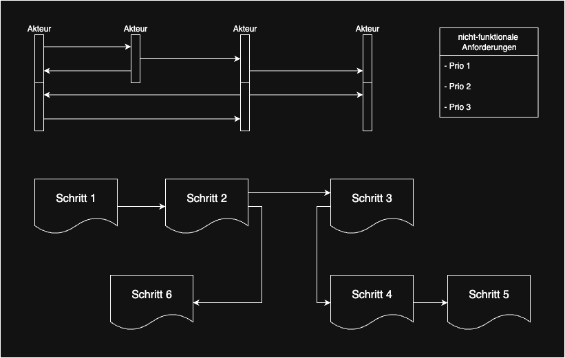
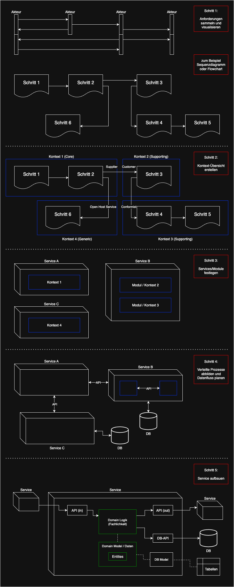

# software-architecture-guide

## Intro

- Allgemein
  - In diesem Dokument wird ein Architektur-Leitfaden aufgezeigt
  - Schritt-für-Schritt werden aufbauend einzelne Abschnitte beschrieben
  - beginnend bei der Fachlichkeit, gefolgt von der technischen Umsetzung
  - es soll dabei helfen den passenden Aufbau für ein Projekt zu finden
  - generell spielen unabhängige Kontexte und Kopplung/Kohäsion eine große Rolle
  - es sind viele Konzepte von Domain Driven Design (DDD) enthalten
  - denn die fachlichen Abläufe sollten in der Technik abgebildet werden
  - bei den Backend-Technologien wird Java & Spring Boot beispielhaft referenziert
  - der Frontend-Bereich wird eher ausgeklammert
- Abschnitte
  - [1) Fachliche Anforderungen sammeln und visualisieren](#1-Fachliche-Anforderungen-sammeln-und-visualisieren)
  - [2) Kontext-Übersicht erstellen](#2-Kontext-Übersicht-erstellen)
  - [3) Technische Services und Module festlegen](#3-Technische-Services-und-Module-festlegen)
  - [4) Verteilte Prozesse_über APIs abbilden und Datenfluss planen](#4-Verteilte-Prozesse-über-APIs-abbilden-und-Datenfluss-planen)
  - [5) Service aufbauen](#5-Service-aufbauen)
- Ein [Beispiel-Projekt](#Beispiel-Projekt) aus der Praxis macht die Konzepte greifbarer
- Außerdem werden [Tipps für den Projektverlauf](#Projektverlauf-überwachen) gegeben

## 1) Fachliche Anforderungen sammeln und visualisieren

- Alle relevanten Personen zusammen bringen
  - Fachexperten, Techniker, Projektleitung, etc
  - Meeting-Formate wie Event Storming oder Domain Storytelling
  - siehe auch [Link](https://www.youtube.com/watch?v=H1hzIFACDHE) bzw [Link](https://www.youtube.com/watch?v=EaKWQ1rsaqQ) 
  - analog mit Post-it's oder digital (zB Miro)
- gemeinsam mit Fachexperten die Domäne verstehen
- eine gemeinsame Sprache (Ubiquitous Language) finden
  - sie darf nicht mehrdeutig sein innerhalb eines Kontextes
  - bedeutet die Personen einigen sich auf bestimmte Begriffe
  - diese werden z.B. in einem Glossar festgehalten
  - und möglichst auch im Code genutzt
- Anforderungen sammeln
  - funktional: Fokus auf das "was" (Mehrwert für Kunde)
  - nicht-funktional: Fokus auf das "wie" (Qualitätsmerkmale), zb:
    - Performance (Antwortzeit, Durchsatz, Skalierbarkeit)
    - Zuverlässigkeit (Fehlertoleranz, Verfügbarkeit)
    - Sicherheit (Authentifizierung, Autorisierung)
    - Wartbarkeit (Modularität, Testbarkeit, Dokumentation)
    - Benutzbarkeit (Barrierefreiheit, Fehlermeldungen)
    - siehe auch [Link](https://quality.arc42.org)
  - Praxis-Beispiel: siehe [Link](https://youtu.be/nJtEvdxvfNQ?t=702)
- Geschäftsprozesse bzw Use-Cases grafisch modellieren
  - Akteure/Objekte bilden Knoten im Diagramm (später Service oder Entity im Code)
  - Aktivitäten sind Verknüpfungen/Kanten über beschriftete Pfeile (später API oder Methode)
  - zb Sequenzdiagramm oder Flowchart

## 2) Kontext-Übersicht erstellen

## 2.1) Kontexte ermitteln
- Die Domäne in Sub-Domänen und Bounded Contexts unterteilen
  - Sub-Domäne
    - Teil vom Problem-Raum
    - fachlicher Teilbereich der Gesamt-Domäne
    - ergibt sich ganz natürlich in den Gesprächen mit Fachexperten
    - kann ein oder mehrere Bounded Contexts haben
    - zb "Bestellung", "Zahlung" oder "Produktkatalog" in E-Commerce
    - siehe auch [Link](https://www.youtube.com/watch?v=NvBsEnDgA4o) bzw [Link](https://www.youtube.com/watch?v=yQgCmMBNle4)
  - Bounded Context
    - Teil vom Lösungsraum
    - der Kontext entsteht aus der fachlichen Sub-Domäne (Übergang Fachlichkeit zu Technik)
    - zb "Order-Context", "Payment-Context" oder Product-Context in E-Commerce
    - Modelle einführen
      - jeder Kontext wird explizit modelliert im Projekt, ist also nicht natürlich vorhanden
      - das Modell soll nicht die reale Welt mit allen Details kopieren
      - sondern gerade genug Informationen bieten zur Lösung des Problems
    - Ausblick auf die Technik
      - ein Kontext kann später zu einem technischen Service werden, muss aber nicht
      - ebenso sind mehrere Kontexte als Module in einem Service möglich
- Context-Map (Landkarte) erstellen, siehe auch [Link](https://www.youtube.com/watch?v=c5H0APovhsw)
- Schnitte einführen, um Kontexte deutlich voneinander abzugrenzen, je nach:
  - Zusammengehörigkeit
    - die Frage klären, welche Bereiche gehören fachlich eng zusammen und welche nicht
    - also wo besteht eine hohe Kohäsion mit gleichzeitig geringe Kopplung zu anderen Bereichen
    - jeder Kontext sollte möglichst isoliert und unabhängig bestehen können
  - Modell- und Sprachgrenzen
    - Begrenzung der Gültigkeit/Konsistenz eines bestimmten Modells und der zugehörigen Sprache
    - wo gibt es sprachliche Differenzen, also unterschiedliche Bedeutungen für denselben Begriff
    - ein Domänen-Objekt soll nicht global einheitlich für alle Bereiche gelten
    - stattdessen hat jeder Kontext sein eigenes individuelles Modell
    - die Ubiquitous Language ist nur im jeweiligen Kontext gültig
    - Beispiel "Bestellung": Unterschied zwischen Vertrieb und Logistik, aber gleicher Name
  - Verantwortung über Daten
    - wer ist der Besitzer der Entitäten im Gesamtprozess, wo gibt es Abhängigkeiten
    - wichtig für die spätere Verknüpfung der Kontexte
- siehe auch Strategic Design von DDD

## 2.2) Kontexte in Kategorien einteilen
- Core: 
  - Kern der Anwendung, zentrale Business-Prozesse
  - bietet Wettbewerbsvorteil auf dem Markt
  - hat eher hohe Komplexität und ändert sich häufiger 
  - möglichst erfahrene Entwickler einsetzen
  - früher umsetzen, evtl. höher skalieren
- Supporting: 
  - unterstützt den Core durch Zusatz-Features 
  - eher allgemeine Aufgaben und weniger Änderungen
  - bietet kein Alleinstellungsmerkmal wie der Code
  - juniorige Entwickler können hier wachsen
  - wird erst später umgesetzt im Projektverlauf
- Generic: 
  - kein Anwendungsbezug, aber ein notwendiges Übel
  - löst teils komplexe, aber schon bekannte Probleme
  - kann man dazukaufen oder outsourcen, zb. Nutzerverwaltung
- siehe auch [Link](https://www.youtube.com/watch?v=ttIRNyoLKqE)

## 2.3) Kontext-Beziehungen definieren
- alle Beziehungen zwischen Kontexten identifizieren
- Abhängigkeiten bzw Richtungen betrachten
  - Upstream, Downstream: liefernde und verbrauchende Kontexte
  - Conformist: Downstream muss sich anpassen, ohne Einfluss auf Upstream
  - Customer/Supplier: aktive Zusammenarbeit der Kontexte, einseitige Abhängigkeit
  - Partnership: beide Seiten sind gleichberechtigt, weil sie gemeinsame Ziele haben
  - Open Host Service: Kontext bietet Schnittstelle für beliebige Nutzer
  - Shared Kernel: gemeinsame Bibliothek (Lib)
  - Separate Ways: Kontexte haben nichts miteinander zu tun und bleiben unabhängig
- in DDD: Context Mapping
- die Einordnung in eine Kategorie hat Einfluss auf die späteren APIs
- also wie stark die Kopplung ist und wo Modellgrenzen liegen
- Entkopplung der Modelle über Anti Corruption Layer (ACL) möglich
  - das Modell eines anderen Kontextes soll evtl. nicht übernommen werden
  - bedeutet es muss ein Mapping an der API erfolgen
  - so ist der Kern eines Kontextes unabhängig gegenüber Änderungen am anderen Modell

## 3) Technische Services und Module festlegen

### 3.1) Modulith vs Microservices
- aus den fachlichen Kontexten sollen technische Bausteine entstehen
- jeder Kontext kann ein eigenständiger Service sein, oder nur ein Modul im Service
- Abwägung (Trade-off) zwischen Unabhängigkeit und Komplexität
- Aufteilung
  - a) ein Service mit mehreren fachlichen Modulen (modular Monolith = Modulith)
    - über Java Packages oder via Maven-Module
    - bietet zum Projektstart ein einfaches Setup und geringe Kosten
  - b) mehrere separate Microservices
    - eigenständig laufende Prozesse, optional auch eigene Git-Repo's
    - initial evtl zu komplex, aber kann im späteren Projektverlauf Vorteile bringen
  - siehe auch [Link](https://www.youtube.com/watch?v=6-Wu178sOEE)

| Einflussfaktoren für die Entscheidung                     | Modulith  | Microservices |
|-----------------------------------------------------------|-----------|---------------|
| **Allgemein:**                                            |           |               |
| Unabhängigkeit in der Entwicklung                         | klein     | groß          |
| Technische Komplexität des Gesamtsystems                  | klein     | groß          |
| **Anforderungen:**                                        |           |               |
| Funktionale Anforderungen                                 | klein     | groß          |
| Qualitätsmerkmale (zb Skalierung, Resilienz, Kosten)      | limitiert | flexibler     |
| **Sonstiges:**                                            |           |               |
| Größe (und Wissen) des Entwickler-Teams                   | klein     | groß          |
| Unterschiedliche Release-Zyklen der Kontexte              | nein      | ja            |
| Deployment-Automatisierung (Pipelines) notwendig          | nein      | ja            |
| Unabhängige Datenmodelle der Kontexte (einfach umsetzbar) | nein      | ja            |
| Technologie-Vielfalt                                      | nein      | ja            |
| Übergreifende Suche/Refactorings einfach möglich          | ja        | nein          |
| Falschen Kontext-Schnitt einfach beheben                  | ja        | nein          |

### 3.2) Von Modulith zu Microservices wechseln im Projektverlauf
- Herausschneiden eines fachlichen Moduls (zb Java-Package) in ein eigenes Repo
- dadurch mehr Flexibilität, aber auch Aufwand in der Entwicklung
- Ablauf & Herausforderungen
  - Interne Java-Schnittstellen bzw Methodenaufrufe zu Http-APIs oder Event umwandeln
  - Datenbank-Schema auftrennen und herauslösen für extra Service-DB
  - Transaktionen nun service-übergreifend abbilden (Koordination notwendig)
  - Querschnittsthemen (Logging, Error-Handling) ggf. duplizieren
- Tipps:
  - gerade zu Projektbeginn noch eher einfach möglich
  - nicht bis auf den letzten Moment warten mit dem Herauslösen, falls eh absehbar
  - ein komplexes Projekt, das ohnehin Services nutzen wird, direkt so starten
  - andernfalls erstmal mit Modulith beginnen (einfaches Refactoring, APIs, etc)

### 3.3) Umgekehrter Wechsel, also von Microservices zu Modulith 
- Services zusammenführen in einen laufenden Prozess
- dadurch übersichtlicher/einfacher, aber weniger flexibel
- Ablauf & Herausforderungen
  - die Art der Modularisierung auswählen (Java, Maven, Lib, etc)
  - Modulgrenzen definieren (ein Microservice == ein Modul ?) 
  - Einhaltung der Grenzen prüfen (Spring Modulith bzw ArcUnit)
  - Änderungen an APIs, DB-Schema, etc umgekehrt zu oben
- Tipps: 
  - falls Schmerz mit Microservices verkraftbar ist, dann dabei bleiben
  - ein Wechsel im fortgeschrittenen Projektstadium wird aufwendig
  - ungewohnt "weiche" Kontext-Grenzen verführen zu Arc-Fehlern

## 4) Verteilte Prozesse über APIs abbilden und Datenfluss planen

### 4.1) Verteilte Prozesse koordinieren
- die Geschäftsprozesse sollen in der Technik abgebildet werden
- falls dies über mehrere Services hinweg geschieht, ist eine Koordination notwendig
- die Auswahl der Koordinationsart hat Einfluss auf das spätere API-Design
- Saga Pattern: 
  - übergreifende, verteilte Transaktion 
  - mit letztendlicher Konsistenz (eventual consistency), kein ACID
  - ist in eine Reihe kleinerer, lokaler Transaktionen aufgeteilt
  - ggf. sind Kompensationsoperationen notwendig
- umgesetzt durch:
  - a) Orchestration 
    - ein zentraler Punkt steuert aktiv die einzelnen Services
    - klare Kontrolle über den Prozessfluss, aber zentrale Abhängigkeit/Kopplung
    - Kompensation: Orchestrator kennt die Reihenfolge und führt Gegenaktionen aus
    - APIs müssen explizite Kommandos bereitstellen (zb /cancel-order)
    - zb Workflow-Engines wie Camunda
  - b) Choreografie 
    - verteilte Steuerung in den Services
      - a) über Events und einen Message-Broker
      - b) direkte Http-Aufrufe (keine Entkopplung, eher verteilte Orchestrierung)
    - hohe Entkopplung und Flexibilität möglich, aber Fluss ist weniger transparent
    - Kompensation: hören auf Events von anderen Services (zb OrderCreationFailed)
  - siehe auch [Link](https://www.informatik-aktuell.de/entwicklung/methoden/orchestrieren-oder-choreografieren-ueber-eine-streitfrage-in-microservices-architekturen.html)

| Einflussfaktoren für die Entscheidung               | Orchestration | Choreografie |
|-----------------------------------------------------|---------------|--------------|
| komplexe Geschäftsprozesse liegen vor               | ja            | nein         |
| viele Fehlerszenarien vorhanden, Monitoring wichtig | ja            | nein         |
| strenge Konsistenzregeln notwendig                  | ja            | nein         |
| Services werden von mehreren Teams verwaltet        | nein          | ja           |
| leichtes Hinzufügen von neuen Services              | nein          | ja           |
| skalieren, parallele Abläufen entscheidend          | nein          | ja           |

### 4.2) Prozesse über APIs verbinden
- API Konzept/Design
  - generell sollten Schnittstellen fachlich modelliert werden, siehe auch [Link](https://www.youtube.com/watch?v=K2eiHDtoo-A)
  - a) CQRS:
    - Commands:
      - Aufträge, imperativ, POST, Seiteneffekt, evtl. nicht idempotent
      - kein PUT und DELETE wie bei REST, die Fachlichkeit entscheidet den Effekt
      - kann via Request oder Message versendet werden
      - Beispiel: /command/register-book
    - Queries
      - Abfragen, GET, idempotent
      - Query-Namen nutzen statt Entität
      - Beispiel: /query/top-selling-books
    - schreibende und lesende Aktionen werden getrennt (Responsibility Segregation)
    - fachlich sprechende Formulierungen in der Gegenwart nutzen
    - Aktionen sind wichtiger als Entitäten, also nicht daten-getrieben denken
    - Endpunkte via Kategorien, nicht Entitäten (zb. /inventory/register-book)
    - nicht mehrere Aktionen in einem Request vermischen, separat halten
    - CQRS kann auch auf die DB angewendet werden (eine DB für Write, eine für Read)
    - bzw kombinierbar mit Event Sourcing
    - siehe auch [Link](https://www.youtube.com/watch?v=cqNGAo-9pUE) bzw [Link](https://www.youtube.com/watch?v=hP-2ojGfd-Q)
  - b) CRUD:
    - eher technisch formuliert, orientiert sich an DB-Operationen
    - API: POST, GET, PUT, DELETE -> DB: Create, Read, Update, Delete
    - Endpunkte werden anhand von Entitäten aufgebaut, also daten-getrieben (REST)
    - für simplen Service mit wenig Fachlogik geeignet
    - bei größeren Systemen ein Anti-Pattern
    - siehe auch [Link](https://www.youtube.com/watch?v=E9yx9w3GJk0)
  - c) Events:
    - Benachrichtigungen austauschen über Ereignisse, die schon passiert sind
    - in der Vergangenheit formuliert (zb RejectedPayment)
    - Events können über Message-Queues verteilt werden an mehrere Services
    - kann CQRS sinnvoll ergänzen
    - kann mit Event Sourcing kombiniert werden (DB Zustand darüber abbilden)
    - siehe auch [Link](https://www.youtube.com/watch?v=vS7sCJ1uezY)
- API Technologie
  - synchron (Request/Response)
    - a) Java Methoden-Call in Modulith
      - direkter interner Aufruf ohne Http (gegen Schnittstelle von Modul) 
    - b) Plain Http
      - Grundbausteine von Http: Url-Pfade, Http-Verben, Status-Codes, etc
    - c) REST:
      - für einfache Service-to-Service Kommunikation
      - Basiert stark auf Plain Http und erweitert es
      - nutzt technische CRUD Operationen
      - Zugriff auf Ressourcen über Url-Pfade (zb /books)
      - nutzt alle Http-Verben und Status-Codes
      - Paging, Sortierung, Filterung möglich
      - es gibt 4 Level die beschreiben wie "RESTful" eine API tatsächlich ist
      - in der Praxis meist keine HATEOAS Links im Einsatz (höchstes Level)
      - möglich Erweiterung: Reactive Stream (Spring Webflux, non-blocking)
    - d) gRPC:
      - für sehr schnelle Service-to-Service Kommunikation
      - direkte Methodenaufrufe im anderen Service, keine Ressourcen
      - nutzt das binäre Format Protobuf (statt Http/Json)
      - daher nicht direkt lesbar, schwerer zu debuggen
    - e) GraphQL:
      - zwischen Frontend und Backend
      - nur ein Endpunkt (/graphql), nur POST-Requests, immer Status-Code 200
      - kein Over/Under-Fetching, selektieren von Properties
      - Caching ist schwieriger umsetzbar
      - Backend-Last abhängig von Frontend, potenzielles Risiko
    - siehe auch [Link](https://www.youtube.com/watch?v=NsdnGAAJfDk)
  - asynchron
    - Messaging-System: RabbitMQ, Kafka, etc.
    - Spring Modulith: Event Publication Registry
    - Sonstiges: zb Webhooks, WebSockets, Server-Sent Events, etc
  - Entscheidung synchron vs asynchron
    - synchron
      - einfacher intuitiver Ablauf, leicht nachzuvollziehen (Entwicklung, Debuggen, Monitoring)
      - direktes Feedback (Antwort oder Fehlermeldung) ohne Umwege
      - keine zusätzliche Infrastruktur nötig, wie zb Message Broker
    - asynchron/event-getrieben
      - Entkopplung der Services, daher einfach erweiterbar um weitere Consumer
      - Pufferung von Messages in Broker (gute Skalierung bei Last)
      - bei einem Ausfall können Events zwischengespeichert und später verarbeitet werden
- Zusammenspiel aus Konzept und Technologie
  - a) CQRS/Events + Plain Http
    - Commands und Queries synchron via Request/Response übertragen
    - ebenso für Events möglich
  - b) CQRS/Events + Messaging
    - Commands und Events asynchron via Message (-Broker) übertragen
    - eine Message kann an mehrere Services zugestellt werden
    - Queries müssen Antworten liefern, Messaging eher ungeeignet
  - c) CRUD + REST
    - synchrone technische Aufrufe via Request/Response
  - d) CRUD + Messaging → eher ungeeignet
- API Trigger
  - a) ein einzelner Request, manuell ausgelöst
  - b) Batch-Verarbeitung (viele Requests)
  - c) Scheduling (zeitgesteuerte Requests)
  - d) event-getrieben (kein klassischer Request)
  - e) Streaming (kontinuierliche Verarbeitung eines Datenstroms)
- API Security
  - zb OAuth2 Flow mit JWT (Spring Security Resource Server)
  - evtl. ein Gateway als zusätzlicher Schutz

### 4.3) Verteilte Datenhaltung steuern
- jeder Service hat seine eigene logische Datenbank
  - evtl. physisch kombiniert, aber kein Zugriff vom anderen Service
  - also keine Kopplung über die Datenbank, damit Zuständigkeit klar ist
- Datenabruf via:
  - a) Pull-Modell:
    - Daten eines anderen Kontextes werden bei Bedarf vom Owner-Service abgefragt
    - ist einfacher und braucht weniger Speicherplatz
    - dauert aber länger und ist fehleranfällig
  - b) Push-Modell:
    - Daten eines anderen Kontextes werden im eigenen Service zusätzlich gespeichert/dupliziert
    - hier reicht unter Umständen eine Teilmenge, also nur so viel wie nötig
    - Aktualisierung der Daten per Event vom Owner-Service notwendig
    - ist komplizierter, verbraucht mehr Speicher und Daten sind evtl. noch nicht konsistent
    - dafür viel schneller und man ist unabhängiger während der Verarbeitung
    - ist bei DDD üblich, denn Entitäten können in mehreren Bounded Contexts vorhanden sein
  - c) Kombination/Hybrid-Ansatz, je nach Art der Daten, bzw je nach Last im System
  - siehe auch [Link](https://www.youtube.com/watch?v=tvs-h8aCjCg)

### 4.4) Interaktion mit der Datenbank
- wie wird gespeichert
  - a) den aktuellen Zustand speichern (CRUD), keine Historie
  - b) oder Event Sourcing
    - Events speichern (nur hinten anfügen, nichts löschen)
    - Zustand per Replay ermitteln (alle Events „aufsummieren“)
    - bzw Zwischenstände (Snapshots) festhalten für bessere Performance
    - siehe auch [Link](https://www.youtube.com/watch?v=yFjzGRb8NOk) bzw [Link](https://www.youtube.com/watch?v=ss9wnixCGRY)
- bei Bedarf CQRS
  - schreibende und lesende Aktionen trennen, also zwei separate Datenbanken
  - Query-Seite ist optimiert für schnelles Lesen, evtl. denormalisiertes Modell
  - Synchronisation/Aktualisierung notwendig per Event
- Transaktionen
  - Ausführung zusammenhängender Geschäftsprozesse (alles oder nichts)
  - das System bleibt in einem gültigen Zustand
  - a) lokale Transaktionen innerhalb einer Klasse (zb @Transactional) 
  - b) Saga Pattern: service-übergreifende Transaktion (ggf. Kompensationsoperation)
  - c) Transaction Outbox Pattern: garantierte Event-Zustellung über extra DB-Tabelle, siehe auch [Link](https://www.youtube.com/watch?v=tQw99alEVHo)

### 4.5) Datenbank auswählen
- Datenbank Technologie
  - a) SQL: strukturierte Daten, komplexe Abfragen
    - Postgres, MySql, etc
    - Spring Data JPA / Hibernate: komplex, mit Cache/Persistence-Context und Dirty Checking
    - oder Data JDBC: einfacher, ohne Caching, führt SQL sofort aus, orientiert an DDD Aggregates
    - siehe auch [Link](https://www.youtube.com/watch?v=AnIouYdwxo0)
  - b) NoSQL: unstrukturierte Daten, einfache Abfragen, gute Skalierung
    - zb MongoDb via Spring Data MongoDB
    - speichern von Objekten ohne extra Entity-Klasse & Repository möglich
- Bei Modulith
  - Tabellen möglichst separat halten, keine Kopplung der Module über die Daten
  - zb eigenes Datenbank-Schema pro Modul
  - oder mit Prefix in Tabellen-Namen arbeiten, falls nur ein Schema gewünscht
- Datenbank Tabellen Design
  - Tabellen normalisieren, um Redundanzen zu minimieren (nicht unbedingt bei noSQL)
  - große verschachtelte Graphen vermeiden, Konsistenzgrenzen einführen
  - wenn nötig mit IDs (Fremdschlüssel) arbeiten statt direkt zu referenzieren

## 5) Service aufbauen

### 5.1) Grundlegende Überlegungen
- Der Service muss grundsätzlich im Kern fachliche Prozesse umsetzen, die der Kunde einfordert
- Hinzu kommen außen herum technische Anbindungen, sodass der Kern seine Wirkung erziehen kann
- Diese beiden Bereiche müssen in der Software passend abgebildet werden
- Generell sollte der Aufbau der Packages und Klassen an die Gegebenheiten des Projekts angepasst sein
- Ein einfaches Projekt mit wenig Fachlichkeit benötigt keinen besonderen Aufbau
- Bei komplexen Domänen mit viel Fachlichkeit kann der Aufbau langfristig sehr entscheidend sein
- Beispiele siehe: [Repo-Verzeichnisse](example_arc)

### 5.2) Aufbau der Packages

Technische Schichten
- Nachfolgend wird beispielhaft eine Bibliothek mit Büchern und Ausleihen zur Demonstration genutzt
- Zu Beginn des Projekts wird oftmals eine technische Unterteilung vorgenommen
- Die Fachlichkeit von Buch und Ausleihe liegt also in einem Package
- Außerdem verlaufen die Abhängigkeiten von oben nach unten (enge Kopplung)
- Das ist bei kleineren Projekten (zb CRUD-App) auch vollkommen in Ordnung
- Es wird allerdings schwierig, schnell zu erkennen, welche Klassen es alles zu einem Bereich gibt (zb Buch)

Transaction Script:
- Trennung von Logik und Daten/State (nicht klassisch objektorientiert)
- DB Entitäten sind primitiv (Anemic Domain Model)
- Die ganze Geschäftslogik liegt in Service-Klassen
- kann irgendwann komplex werden (Service 1 -> Service 2 -> Service 3)

Domain Modules
- Besser ist es daher, alle Klassen fachlich in Feature/Module aufzuteilen auf oberer Ebene 
- Man sagt dazu auch Package by Feature (statt Package by Layer), siehe [Link](https://www.youtube.com/watch?v=B1d95I7-zsw)
- Die Beziehungen zwischen den Modulen kann zb Spring Modulith (ArcUnit) prüfen
- Dann liegen allerdings potenziell sehr viele Klassen in einem Ordner
- Eine Möglichkeit wäre, auch hier wieder technische Unterordner einzuführen
- Bei komplexen Domänen ist dies aber langfristig nicht zielführend
- Daher wird ein Aufbau empfohlen, bei dem der fachliche Kern im Vordergrund steht und möglichst unabhängig von der Technik ist

Dependency Inversion
- Bedeutet, die Abhängigkeiten sollen von außen nach innen gerichtet sein, auch wenn der Aufruf nach außen geht
- Die lose Kopplung erreicht man durch den Einsatz von Interfaces
- Die Schnittstelle (Port) liegt dabei neben der Fachlichkeit, sodass sich die Abhängigkeit dreht
- Es gibt also keinen direkten Bezug zur Technologie/Implementierung (Adapter)
- Bei eingehenden Aufrufen (Inbound/Driving-Adapter) ist ein Interface optional

Neuer Aufbau im Modul
- Hier gibt es 3 sehr ähnliche Ansätze: Onion, Clean und hexagonale Architektur (Ports & Adapters)
- Diese sind ideal, um die Grundideen von DDD umzusetzen
- siehe auch [Link](https://www.youtube.com/watch?v=JubdZIdLQ4M) bzw [Link](https://youtu.be/BFXuFb40P8k?t=2295)
- Beispiel + Code, siehe [Link](https://reflectoring.io/spring-hexagonal/)
- Nachfolgend wird der Onion/Clean-Aufbau mit Ports & Adapters kombiniert
- Rot: Infrastruktur, Orange: UseCases, Grün: der fachliche Kern
- Es werden erstmal alle (alten) Klassen verschoben in die neue Struktur
- Damit ändert sich zwar noch nichts am Zusammenspiel, aber die Grundlagen sind gelegt

### 5.3) Zusammenspiel der Klassen

Services auftrennen
- Mit der Zeit können in einem Projekt sehr viele Service-Klassen entstehen
- Denn es sollen fortlaufend neue Anforderungen vom PO umgesetzt werden
- Es entsteht ein Service-Caos, also die Verantwortlichkeiten/Abhängigkeiten sind unklar
- Als Lösung wird im Beispiel der BuchService aufgetrennt
- UseCases einführen
  - Logik zur Orchestrierung landet in UseCase-Klassen 
  - Dafür ist ein extra Onion-Ring bzw Package vorgesehen
- Domain Model / Object Oriented Design
  - Fachliche Regeln (zb Validierung) werden in die Entity verschoben
  - Die Entity hat also nicht mehr Getter/Setter, sondern fachliche Methoden
  - Das Objekt kümmert sich selbstständig um einen gültigen Zustand, nicht der Service
  - Logik und Daten/State liegen somit gemeinsam in einer Klasse (Rich Domain Model)
  - Außerdem gibt es nach wie vor JPA-Annotation zur Verarbeitung in der Datenbank
  - Dies wird in einem späteren Schritt gefixt
- Domain Service bleibt übrig:
  - Der anfängliche BuchService wird zum DomainService
  - Es bleibt nur Logik zurück, die Entity-übergreifend ist und nicht orchestriert
  - Evtl. braucht man die Service-Klasse auch gar nicht mehr

API-Clients auftrennen
- Problem: die UseCases (bzw die Domain) hängt direkt von der Technik ab
- Lösung: Ein Interface (Port) dreht via Dependency Inversion die Abhängigkeit um
- Wichtig: die fachliche Schnittstelle liegt nicht im Infrastruktur-Package!
- Der Fachlichkeit ist somit egal, ob REST oder etwas anderes verwendet wird
- Zur Laufzeit steht einfach via Dependency Injection eine Implementierung bereit

Persistenz auftrennen
- Problem: in der Domain befindet sich nach wie vor Technik in Form von JPA
- Lösung: auch für die Entity und das Repository fachliche Klassen/Schnittstellen einführen
- Also ebenso hier wieder Dependency Inversion via Ports (wie beim Client)
  - Entity
    - Die Entity wird aufgetrennt in eine fachliche DomainEntity
    - Alles mit Technik liegt in der JPAEntity
    - Dazwischen muss ein Mapping der Entities erfolgen
  - Repository
    - Es wird zusätzlich ein fachliches DomainRepository-Interface angelegt
    - Dies wird in der Infrastruktur von einer Klasse implementiert
    - Darin wird dann das JPA-Repository und der Entity-Mapper verwendet
- Wie zu sehen ist, entsteht ein relativ hoher Aufwand (weitere Klassen + Mapping)
- Dieser Schritt sollte also gut überlegt sein
- Folgendes Video beschreibt einen Weg ohne Split, siehe [Link](https://youtu.be/VGhg6Tfxb60?t=1550)

### 5.4) Daten modellieren
- Es wird ein Modell der Wirklichkeit in der Software benötigt
- Bedeutet, alle Objekte/Knoten aus den fachlichen Abläufen müssen abgebildet werden
- zb Komponenten aus DDD Tactical Design nutzen, siehe auch [Link](https://www.youtube.com/watch?v=xFl-QQZJFTA)
  - Entity
    - hat eine stabile Identität, auch wenn sich Eigenschaften ändern
    - zb "Bestellung"
  - Value Object
    - ohne eigene Identität, also zählt nur durch seine Werte
    - ist unveränderlich (immutable), muss komplett ersetzt werden durch neue Instanz
    - ermöglicht Wiederverwendung und Verhinderung von Nebeneffekten
    - zb "Adresse" oder "Geldbetrag"
  - Aggregate
    - eine Gruppe zusammengehöriger Objekte, die konsistent als Ganzes verwaltet werden
    - also Entities + Value Objects, zb "Bestellung" + "Adresse" + "Geldbetrag"
    - eine Entity fungiert als Aggregate Root (Abruf via Repository)
    - der Zugriff auf Elemente des Aggregates erfolgt ausschließlich via Root-Entity
    - bedeutet es kann nicht direkt ein Sub-Element von außen geändert werden
    - im Beispiel ist das Ersetzen der "Adresse" ohne die "Bestellung" nicht möglich
- falls man das Daten-Modell direkt mit Technologien (Spring-JPA) mischt:
  - Entity: klassische @Entity mit @Id und Properties
  - Value Object:
    - private + final Properties und keine Setter-Methoden
    - optional: kann direkt in die Entity-Tabelle eingebettet werden (keine extra Tabelle)
    - @Embeddable Klasse via @Embedded in @Entity nutzen
  - Aggregate: Zugriff via @Repository-Interface (extends JpaRepository<Bestellung, Long>)

### 5.5) Zusammenfassung

- Ein fachlicher Geschäftsprozess wird durch die DDD-Onion Architektur sauber aufgeteilt
- Es gibt nicht mehr viele vermischte Service-Klassen mit enger Kopplung zur Technik
- Stattdessen hat jede Ebene eine klare Verantwortung und fachliche Schnittstellen (Ports)
- Die Abhängigkeiten verlaufen von außen nach innen (Fachlichkeit ohne Technik) 
- Ablauf eines Prozesses
  - Ein UseCase wird vom Inbound-Adapter getriggert und orchestriert den groben Ablauf
  - Er läd über das DomainRepository ein Aggregat an Entities und Value Objects
  - Zusätzlich kann er über den Client-Port weitere Daten anfragen
  - Beide Aufrufe kennen die konkrete Technik dahinter nicht, nur fachliche Objekte & Methoden
  - Nun können Zustände verändert und wieder gespeichert werden
  - Dabei weiß jede Entity selbstständig, welche Aktionen erlaubt sind
  - Das Ergebnis meldet der UseCase an den Adapter zurück oder sendet ein Event
- Vorteil Testing
  - Die Fachlogik kann unabhängig/isoliert von der Technik getestet werden
  - Z.B. kann hinter dem DomainRepository (Port) ein Mock via In-Memory-Liste stecken
  - Der Unit-Test läuft somit sehr schnell durch
  - Außerdem fokussiert er sich rein auf die Logik (bessere Wartung)
- Vorteil Austauschbarkeit
  - Ohne die Kopplung zur Technik kann man einfach APIs oder DBs austauschen
  - Tendenziell ändert sich die Technik häufiger als die Fachlogik
- Vorteil Langlebigkeit
  - Die Fachlogik ist das Wertvollste der gesamten Architektur und muss geschützt werden
  - Sie sollte über viele Jahre stabil laufen (Kerngeschäft der Firma) 
  - Dies wird durch DDD + Onion gefördert
- siehe auch [Link](https://youtu.be/saa6tSN0w8Q?t=707)

### 5.6) Frontend
- die UI wurde in diesem Dokument bewusst eher ausgeklammert, kurz und knapp:
- Aufteilung
  - a) ein extra Frontend für alle Services
    - typischerweise gibt es in einer Microservice-Architektur ein separates Frontend
    - also eine eigenständige App, die über APIs die verschiedenen Backends aufruft
    - ggf. wird es von einem extra Team entwickelt
  - b) Frontend pro Service
    - jeder Service kann aber auch ein eigenes Frontend besitzen
    - damit nähert es sich einem Self-Contained Systems (SCS) an
    - es bildet einen Geschäftsbereich mit Frontend, Backend und Datenbank ab
    - falls es keine/geringe Abhängigkeiten zu anderen Services gibt
    - das SCS ist also umfangreicher und autarker als ein Microservice
    - und wird in der Regel nur von einem Team betreut
- Backend for Frontend (BFF)
  - jedes Frontend kann bei Bedarf noch ein kleines Backend im Hintergrund besitzen
  - also Frontend -> BFF -> Backends
  - das BFF ist spezialisiert für die Art der UI, zb Web-Frontend oder Mobile-App
  - es aggregiert und transformiert die Responses der unterschiedlichen Backends
  - und stellt die Daten maßgeschneidert, im passenden Format bereit ohne Overhead
  - Logik wird also aus dem Frontend herausgezogen in das BFF
  - es kann auch Funktionen eines API-Gateways integrieren (Auth, Rate Limiting, etc)
  - falls nur ein BFF gewünscht ist bietet sich GraphQl an

## Gesamter Ablauf des Architektur-Leitfadens

## Beispiel-Projekt

### 1) Vorgaben
- Aufgabe: 
  - Verwaltung einer einfachen Bibliothek
  - Software soll von Bibliothekar genutzt werden
- Randbedingungen
  - kleines Team, also nur wenige Entwickler
  - kurze Entwicklungsdauer geplant
- nicht-funktionale Anforderungen
  - Kosten sollten niedrig bleiben
  - wenige gleichzeitige Nutzer, keine hohe Skalierung notwendig
  - Anwendung wird nur tagsüber eingesetzt

### 2) Durchführung

### 3) Erklärung
- aus dem Sequenzdiagramm ergibt sich
  - das Ausleihen und Zurückgeben von Büchern ist der Haupt-UseCase (Core)
  - die Verwaltung von Büchern und Nutzern ist ein notwendiges Übel
  - die Nutzerverwaltung könnte dazugekauft werden (Generic)
  - die Buchverwaltung kann einfach gehalten werden (Supporting)
  - der Bibliothekar muss nicht extra abgebildet werden, er nutzt die Software
- es wird ein modularer Monolith verwendet, keine Microservices
  - denn es muss nicht separat skaliert werden
  - und es gibt nur ein kleines Entwickler-Team
  - das mit überschaubaren Kosten die Anwendung entwickeln soll
- die APIs sind fachlich mit CQRS formuliert
  - sprechende Commands & Queries verdeutlichen die Intension
  - obwohl initial auch technische REST-Endpunkte möglich wären
  - aber CRUD wäre bei steigenden Anforderungen nicht mehr passend
  - die Kommunikation erfolgt anfangs synchron mit Request/Response
- es wird nur eine physische Datenbank verwendet, aber extra Schemas je Modul
  - so wird eine Trennung der Datenmodelle erzwungen
  - es ist also keine direkte Kopplung der Entitäten/Kontexte möglich
  - dies ermöglicht später eine einfachere Auftrennung in Services
  - nur eine Datenbank-Instanz reduziert Kosten
  - SQL passt gut zu den vorhandenen Strukturen
  - auf Event Sourcing wird verzichtet, da Historie nicht relevant
- kein Anti Corruption Layer in Ausleih-Modul
  - es wird das Datenmodell der anderen beiden Kontexte übernommen
  - Bücher und Nutzer werden über IDs referenziert
- der Zugriff auf Clients und die Datenbank wird abstrahiert
  - Schnittstellen ermöglichen später mehr Flexibilität
  - Nutzung von Ports & Adapters

### 4) Technische Umsetzung
- ein Git-Repository aufsetzen
- ein Spring-Boot Projekt anlegen
  - Starter-Dependencies (Web, Data) einfügen
  - fachliche Module definieren
  - Controller, Services, Entities, Clients. etc anlegen
  - automatisierte Tests kontinuierlich erweitern
- Datenbank als Docker-Container hochfahren
- regelmäßig neue Stände via Pipeline deployen in Cloud
- manuelle Tests via API-Client
- Monitoring der Logs
- Architektur in Dokumentation festhalten

## Projektverlauf überwachen

### 1) Subjektive Empfehlungen für den Start und Verlauf eines Projekts
- Kontexte nach bestem Wissen definieren und stetig Beziehungen prüfen
  - sind die Modellgrenzen nützlich oder behindern sie eher?
  - sind Abhängigkeiten doch anders gerichtet als anfangs gedacht?
- zu Beginn eher mit einem modularen Monolithen starten, später bei Bedarf Microservices
  - ggf. einzelne Module herauslösen zu eigenen Services
  - orientiert sich an nicht-funktionalen Anforderungen und Projektteam
- erste APIs direkt mit fachlichen CQRS-Endpunkten aufsetzen 
  - mit einfachen synchronen Schritten beginnen
  - bei steigender Komplexität auf asynchrone Abläufe umstellen
  - erst dann weitere System-Komponenten (zb Message-Queue) integrieren
- die Datenbank möglichst nicht ändern im Projektverlauf
  - eher etablierte SQL-Technologien nutzen, falls Strukturen ersichtlich sind 
  - ggf. Teile ohne Schema in Json-Spalte speichern
  - Zustände anfangs direkt ablegen (einfacher), also ohne Event Sourcing
- Microservice bzw Modul intern einfach halten
  - Logik in Service-Klassen gruppieren, falls Komplexität überschaubar bleibt
  - Interfaces erst bei Bedarf einführen im Projektverlauf
  - ggf. Ports/Adapter nutzen in Richtung ausgehender Aufrufe (DB/API)
  - Spring in Business-Logik nicht schlimm (Austausch vom Framework unrealistisch)
  - möglichst viele Klassen auf package-private stellen, um Kopplungen zu verhindern  
- fortlaufend die Code-Qualität prüfen
  - von Anfang an Tests erstellen und erweitern
    - Fokus auf Qualität statt Menge/Code-Coverage
    - also lieber wenige Test, aber genau auf die fachlichen UseCases bezogen
    - statt viele technische Randbedingen zu prüfen, die Qualität vorgaukeln 
  - Refactoring durchführen, also Klassenstrukturen/Methoden gerade ziehen

### 2) Architektur entwickelt sich weiter
- ein perfekter Entwurf zum Projektstart ist unrealistisch
- die Architektur muss stetig verfeinert und angepasst werden
- Architekturziele messbar und automatisiert überprüfbar machen (Architecture Fitness Functions), zb:
  - Struktur: Einhaltung von Layern und Modulgrenzen via Spring Modulith (ArcUnit)
  - Qualität: Code und Abhängigkeiten (Beispiele: SonarQube, Mend, Fortify)
  - Verhalten: Antwortzeit, Durchsatz, Fehlertoleranz via Lasttest-Tool
- dabei sollten die Qualitätsmerkmale im Vordergrund stehen, siehe auch [Link](https://www.heise.de/blog/Woran-erkennt-man-eine-gute-Softwarearchitektur-7541527.html)
- falls manche Qualitäten nicht ausreichend erfüllt sind, dann Maßnahmen einleiten, zb:
  - Verbesserung der Wartbarkeit (zb über Modularisierung oder losere Kopplung)
  - Bessere Performance (zb über Microservices, asynchrone Verarbeitung oder Caching)
  - Mehr Zuverlässigkeit (zb über DB-Redundanzen oder Retry-Mechanismen)
- gravierende Änderungen/Entscheidungen als ADR festhalten, siehe auch [Link](https://www.heise.de/hintergrund/Gut-dokumentiert-Architecture-Decision-Records-4664988.html)
- grundlegender Aufbau eines Architecture Decision Records:
  - Status festlegen (zb vorgeschlagen, beschlossen oder veraltet)
  - Kontext beschreiben (Hintergrundinformationen und Rahmenbedingungen)
  - Mögliche Optionen vergleichen und eine Entscheidung treffen
  - Begründung der gewählten Lösung und welche Auswirkungen sich daraus ergeben

### 3) Mit technischen Schulden umgehen
- diese lassen sich nie komplett vermeiden
- Ursachen
  - fehlende Architekturplanung bzw Anpassung
  - veraltete oder unpassende Technologien
  - kurzfristige Entscheidungen aus Zeitdruck
  - fehlende Dokumentation und Wissensverlust
  - unzureichende Qualitätssicherung
- Beispiele
  - Architektur
    - enge Kopplung zwischen Komponenten
    - Vermischung von Schichten
    - keine klare Verantwortungszuordnung
    - schlechte Fehlerbehandlung/Logging/Monitoring
  - Framework & Infrastruktur
    - veraltete Bibliotheken, Frameworks, Server
    - unsichere Konfigurationen
    - keine Automatisierung (CI/CD-Pipeline)
    - schlechte Versionierung 
  - Code
    - duplizierte Abschnitte
    - nicht sprechende Namen
    - geringe Testabdeckung, bzw zu viel manuell
    - Verletzung von Clean Code-Prinzipien (SOLID, DRY, KISS)
- Umgang
  - kategorisieren nach Typ und Risiko
  - sichtbar machen über Dokumentation, zb TDR, siehe auch [Link](https://www.heise.de/blog/Technical-Debt-Records-Dokumentation-technischer-Schulden-9876115.html)
  - kommunizieren bei der Projektplanung
  - Auswirkungen aufzeigen, zb:
    - steigende Kosten für das Projekt
    - geringere Entwicklungsgeschwindigkeit neuer Features
    - höhere Fehleranfälligkeit im Produktivbetrieb
  - nach und nach minimieren durch extra Tickets im Sprint, zb
    - Architektur im Team und mit Experten besprechen + nachziehen
    - Aktualisierung und Automatisierung der Infrastruktur
    - Refactorings im Code

### 4) Dokumentation der Architektur
- Allgemein
  - die Doku sollte eher schlank gehalten sein 
  - so können Änderungen einfach erkannt und integriert werden
  - der Fokus sollte auf konstante/stabile Bereiche gelegt werden
  - Elemente die sich noch häufig ändern nur auf hoher Flugebene anreißen
- Technische Architektur festhalten
  - Strukturvorgabe und Templates im deutschsprachigen Raum meist via [arc42](https://arc42.de/overview/)
  - Bausteine visualisieren über zb arc42-Bausteinsicht mit [C4-Modell](https://c4model.com) zur Unterteilung
  - C4 besteht aus Context, Container, Component und Code (Top-Down)
  - Sequenzdiagramme mit zb UML in arc42-Laufzeitsicht zeigen dynamisches Verhalten
- Tools
  - für C4: zb [structurizr](https://structurizr.com) oder [C4-PlantUML](https://github.com/plantuml-stdlib/C4-PlantUML)
  - für UML: zb [PlantUML](https://plantuml.com/de/) oder [draw.io](https://www.drawio.com)
- Canvas
  - kompakte, übersichtliche Darstellung auf einer Seite in einer Tabelle
  - Leinwand (Canvas) mit vorgegebenen Feldern
  - enthält nur die wichtigsten Aspekte eines Systems
  - leichtgewichtiges Hilfsmittel für frühe Projektphasen oder Reviews
  - kein Ersatz zu arc42, sondern eine Ergänzung 
  - Vorlagen: zb [arc42-Canvas](https://canvas.arc42.org), [software-component-canvas](https://github.com/feststelltaste/software-component-canvas)
